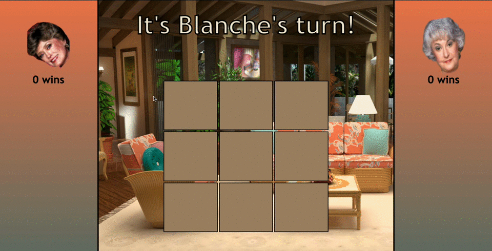

# golden-tic-tac-toe

## Context and Features

Adding a little sass to the classic game of tic-tac-toe.  Choose your fighter- Blanche Devereaux or Dorothy Zbornak from the Golden Girls.

-Players take turns placing a token on the game board.

-First player to get three of their tokens in a row wins.

-No winner calls for a draw.

-Quotes from the show are displayed according to if the player wins or loses.

-Player icons on either side wiggle to display whose turn it is.

-Tic-Tac-Toe boxes highlight and enhance as the cursor moves over them.

## Illustrations

## Technologies Used

- HTML
- CSS
- JavaScript

## Future Features

Some future features that could be implemented into this page are:

- Local storage.

- The ability to choose a player from the four characters from the show.

- Player high score board that keeps track of all time wins.

## Running Application Locally

1. Fork repository on GitHub.

2. `Git clone` the repository to your local machine.

3. `Cd` into the directory.

4. Run `open index.html` in your terminal.

### Contributor LinkedIn Profiles

- [Trish Fox-Collis](https://www.linkedin.com/in/trish-fox-collis/)

### Other Work From the Contributor:

- [Trish Fox-Collis](https://github.com/tfoxcollis)

### Project Specs

- The spec for this application can be found [here](https://frontend.turing.edu/projects/module-1/tic-tac-toe-solo-v2.html)
